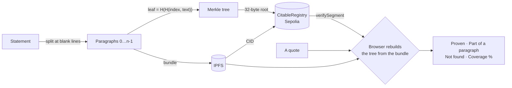

# Citable

**Anyone can invent a quotation. Now you can prove you didn't.**

A register of statements on Ethereum. A statement is cut into paragraphs, each paragraph is
bound to its position, and only the root of that tree goes on chain. Whoever quotes from it
can hand over a proof with the quote: *this passage, word for word, at paragraph 5 of 7, in
this text, on this date.* When there is no word-for-word match, Citable says so — and
measures, openly labelled as a measurement, whether a translation or paraphrase is covered
by the text.

**[Live app →](https://citable-pi.vercel.app/)** ·
[Registry on Etherscan](https://sepolia.etherscan.io/address/0xd3b137b6c6f572290cf91ac312319364822792e7#code) ·
[Name guard](https://sepolia.etherscan.io/address/0x67732407626bcb5d5610887ec97782c610f5e8d2#code) ·
ETHOnline 2026 · Sepolia


---

## Contents

- [Try it in a minute](#try-it-in-a-minute)
- [The problem](#the-problem)
- [How it works](#how-it-works)
- [What lives where](#what-lives-where)
- [Identity: who may publish under a name](#identity-who-may-publish-under-a-name)
- [Deployments](#deployments)
- [Status](#status)
- [Repository layout](#repository-layout)
- [Run it locally](#run-it-locally)
- [Limitations](#limitations)
- [Prior art](#prior-art) · [AI usage](#ai-usage) · [License](#license)

---

## Try it in a minute

Open **[citable-pi.vercel.app](https://citable-pi.vercel.app/)**, go to *Check a quote*,
enter the name and paste the quote. Every row below was run against the live site on
13.09.2026; the answers are the ones it gave.

| Who | Quote | Answer |
|---|---|---|
| `wochenzeitung.eth` | `Von den siebzehn Sachverständigen haben elf schriftlich Stellung genommen. Zwei dieser Stellungnahmen sind in den Ausschussbericht eingeflossen, die übrigen nicht.` | **PROVEN** — paragraph 5 of 7, both neighbours shown |
| `wochenzeitung.eth` | the same, with `elf` changed to `zwölf` | **NOT FOUND** — one word, and the proof is gone |
| `wochenzeitung.eth` | `Vier Werktage sind wenig für eine Vorlage dieses Umfangs` | **PART OF A PARAGRAPH** — paragraph 4 of 7, with the context that was cut |
| `wochenzeitung.eth` | `Wir haben das Gesetz im Alleingang durchgewunken.` | **NOT FOUND** — with the denominator: the statements searched and the paragraphs compared |
| `tagesschau.eth` | anything | **NOTHING REGISTERED** — explicitly not "made up" |
| `wochenzeitung.eth` | `Revenue rose by four percent last quarter.` → *Measure coverage* | **Covered, 83 %** — paragraph 3 of 6, entailment 0.8253 |
| `wochenzeitung.eth` | `Im vergangenen Quartal stieg der Umsatz um vierzig Prozent.` → *Measure coverage* | **Not measured** — the paragraph says four; a number the text never states cannot be covered, so no model is asked |
| `wochenzeitung.eth` | `Roth hat zugegeben, dass die Zahlen manipuliert wurden.` → *Measure coverage* | **9 %** — on the same topic, not covered |

The first measurement downloads about 400 MB of models into the browser, once.

The last row is the argument for the whole third stage: on plain similarity, that false
quote scored **0.880** against the paragraph it distorts — *higher* than a correct
translation of that paragraph at **0.877** (`CONCEPT.md` §3).

## The problem

Quoting out of context is the most common form of disinformation, and there is no
infrastructure against it. A link breaks when the original is deleted. A screenshot can be
forged by anyone. And once a quote crosses a language border, even a careful reader has no
way to check it.

Nobody can prove a sentence was never said — nobody holds every word a person spoke. So
Citable turns the burden around. It does not ask *"is this quote real?"* It lets the person
quoting say **"here is the proof that I quoted correctly."**

## How it works



### The leaf

```
leaf = keccak256(keccak256(abi.encode(uint256 index, string segment)))
```

The index sits *inside* the leaf. `merkletreejs` sorts sibling pairs, which discards their
order — without the index, a proof would show membership but not position, and position is
the entire claim. The double hash is the OpenZeppelin convention against second-preimage
attacks. `test/Leaf.t.sol` calls the JavaScript implementation over FFI and compares it
against the Solidity one on every run, so the two cannot drift apart unnoticed.

### Segmentation rule

Author and verifier must build the same tree, so the rule is fixed and deliberately dumb:

- split on `\n\n` (blank line) — paragraphs, not sentences
- trim whitespace at both ends of each segment
- drop empty segments
- UTF-8, no normalisation

Sentence boundary detection is language-dependent, and two implementations disagree.
Paragraphs are unambiguous. This costs granularity and buys agreement.

### Three stages, three kinds of answer

| Stage | Question | Nature of the answer |
|---|---|---|
| 1 · Wording | Is this paragraph in the statement, and at which position? | **proof** — checked by the contract |
| 2 · Excerpt | Was the fragment cut out of a paragraph? | **fact** — shown with the full paragraph |
| 3 · Coverage | Is the claim covered by the text, in any language? | **measurement** — and it can be wrong |

Stage 3 exists because translations share no bytes with the original. It uses a
multilingual embedding model to find candidate paragraphs and an NLI model to judge whether
the claim is *entailed* — not merely on the same topic. Before either model runs, a
deterministic value check (`lib/citable/guards.mjs`) refuses claims that introduce a number
or a form of address the paragraph never states — the two things a forger changes most
often, and the two a model is vaguest about.

A stage-3 percentage means **"no distorted quote in the test set reached this value"**,
never "83 % true". The paragraph is always shown in full next to it, so the reader judges.
The measurements behind these decisions are in [`CONCEPT.md`](CONCEPT.md) §3, produced by
`script/js/similarity-probe.mjs`, `nli-probe.mjs` and `entailment-eval.mjs`.

## What lives where

| Where | What | Why there |
|---|---|---|
| **Sepolia** | root, author, ENS node, timestamp, paragraph count, CID | 32 bytes, immutable, publicly checkable |
| **IPFS** | the bundle: full text as indexed paragraphs | too large for the chain; the CID binds it |
| **The reader's browser** | tree rebuild, proof, stage 3 | nothing to trust in between |
| **`api/pin.mjs`** (Vercel function) | pins a bundle when a statement is registered from the site | a browser must never hold a pinning key |

**Checking a quote needs no service at all.** There is no database and no indexer: the
statements under a name are found through the indexed `ensNode` topic of the registry's
event, the bundle is fetched from IPFS, and the browser rebuilds the tree and asks the
contract. Several sources race for the bundle, and the first whose bytes **rebuild the root**
wins — a source serving anything else loses the race instead of being believed. The screen
names the source that answered.

**Publishing uses one small helper, for reachability only.** A CID nothing serves is a dead
link, and the register screen cannot pin by itself. So on the click that registers,
`api/pin.mjs` pins the bundle *first*; only then is the transaction offered. The function
accepts a bundle only if it rebuilds the root the browser states, pins the bytes exactly as
received, and the browser checks the returned CID against its own. It can refuse — then the
screen asks the author to keep the bundle and sends nothing. It cannot make a false bundle
pass, because every bundle is anchored to the root on chain.

## Identity: who may publish under a name

With the guard set, `registerRoot` requires the caller to be allowed under the ENS name it
claims. `ENSv2NameGuard` implements `INameGuard` against the ENSv2 registry on Sepolia.

It is not a pure ownership check. The holder may publish, and so may anyone the holder
granted the publish role (`ROLE_SET_RESOLVER`) for that name — what a newsroom looks like:
an editor publishes under the paper's name without owning it. Both paths are covered by a
fork test against the live registry.

Two details cost the most time:

- **Token ids are not labelhashes.** ENSv2 keeps a version in the lower 32 bits of the id,
  so `ownerOf(labelhash(name))` returns `0x0` for every name. The guard never derives an id;
  it asks the registry, which resolves the version itself (`script/js/ens-probe.mjs`).
- **`ensNode` is `labelhash(label)`, not an ENSv1 namehash.** A namehash cannot be turned
  back into a label, and without the label the registry finds no entry. Version 1 covers
  second-level names of one registry.

## Deployments

| | Sepolia |
|---|---|
| `CitableRegistry` | [`0xD3B137b6c6f572290Cf91ac312319364822792e7`](https://sepolia.etherscan.io/address/0xd3b137b6c6f572290cf91ac312319364822792e7#code) — verified |
| `ENSv2NameGuard` | [`0x67732407626BCb5D5610887EC97782c610F5E8d2`](https://sepolia.etherscan.io/address/0x67732407626bcb5d5610887ec97782c610f5e8d2#code) — verified, wired |
| ENSv2 `ETHRegistry` | `0xBDC85dD5b15D7ecb354cd7cb6f2c50b4f2c4F0E2` |
| Frontend | [citable-pi.vercel.app](https://citable-pi.vercel.app/) — static export plus one function |
| IPFS gateway | `indigo-broad-pig-566.mypinata.cloud` |

`statementCount()` reads **8**. The three published from this repository have their source
text in [`statements/`](statements/) and a record in [`deployments/statements/`](deployments/statements/):

| Statement | Name | Root | Paragraphs |
|---|---|---|---|
| [`anhoerung.txt`](statements/wochenzeitung/anhoerung.txt) | `wochenzeitung.eth` | `0xa2ea6730…891ebc4b` | 7 |
| [`quartalszahlen.txt`](statements/wochenzeitung/quartalszahlen.txt) — verbatim the stage-3 evaluation corpus | `wochenzeitung.eth` | `0x2690f5f5…33b45caf` | 6 |
| [`gettysburg.txt`](statements/frederik/gettysburg.txt) | `frederik.eth` | `0x78e0a0fd…14c4e972` | 4 |

The other five were registered through the site while it was being built. Four of them
went on chain before pinning from the site worked, and carry CIDs no node serves — the
failure `api/pin.mjs` exists to prevent. They stay, because nothing on chain can be removed.

## Status

| | |
|---|---|
| Leaf hashing, JS ↔ Solidity parity | ✅ 6 tests, FFI against the JS implementation |
| `CitableRegistry` with position proofs | ✅ 13 tests |
| JS-built proofs accepted by the contract | ✅ 4 tests |
| `INameGuard` gate on `registerRoot` | ✅ 12 tests |
| `ENSv2NameGuard`, incl. a fork test against Sepolia | ✅ 15 + 5 tests |
| Client library: segment, tree, bundle, CID, value check, pin gate | ✅ 68 JS tests |
| CID computed without kubo | ✅ checked against kubo's own vectors |
| Contracts deployed and verified on Sepolia | ✅ guard armed from the first statement |
| Verify screen, stages 1 and 2, search by ENS name without an indexer | ✅ live |
| Stage 3 in the browser | ✅ live, reproduces the measured numbers |
| Register screen, pinning before the transaction | ✅ live |
| Author screen | ❌ not built — cut for time |

CI runs `forge fmt --check`, `forge build` and `forge test` on every push
([`.github/workflows/test.yml`](.github/workflows/test.yml)).

## Repository layout

```
src/            Solidity: CitableRegistry, Leaf, INameGuard, ENSv2NameGuard
test/           Foundry tests; test/js/ holds the client library tests
script/         Deploy.s.sol, and script/js/: publish, pin, ENS and the stage-3 measurements
lib/citable/    The client library — the one implementation of segment, leaf, tree, bundle, CID
api/            pin.mjs, the Vercel function that pins a bundle for the register screen
frontend/       Next.js app, exported statically; imports lib/citable/ through an alias
statements/     Source text of every statement published from this repository
deployments/    Deployed addresses and one record per published statement
CONCEPT.md      The specification, with the measurements the decisions rest on
notes/          The working journal, chapter by chapter (German)
prompts/        The briefs given to Claude Code, kept as written (German)
design/         Hero variants and the screenshot above
```

## Run it locally

```bash
forge install
npm install          # required: the parity tests shell out to the JS implementation
forge test           # 55 tests; the 5 fork tests need SEPOLIA_RPC_URL and skip without it
npm test             # 68 client library tests

cd frontend && npm install && npm run dev
```

| Variable | |
|---|---|
| `SEPOLIA_RPC_URL`, `PRIVATE_KEY`, `ETHERSCAN_API_KEY` | `.env` — deploying and publishing from the command line |
| `PINATA_JWT` | Server-side only, never with a `NEXT_PUBLIC_` prefix. Used by `publish.mjs`, `pin.mjs` and `api/pin.mjs` |
| `NEXT_PUBLIC_SEPOLIA_RPC_URL` | Optional. Without it viem uses a rate-limited public endpoint |
| `NEXT_PUBLIC_IPFS_GATEWAYS` | Optional. Comma-separated gateway prefixes |

Under `next dev` the pinning function does not exist, and the register screen says so and
falls back to the download; `vercel dev` runs it.

### Deploy

```bash
forge script script/Deploy.s.sol --rpc-url $SEPOLIA_RPC_URL                      # dry run
forge script script/Deploy.s.sol --rpc-url $SEPOLIA_RPC_URL \
  --private-key $PRIVATE_KEY --broadcast --verify                                # for real
```

Deploys `CitableRegistry`, then `ENSv2NameGuard`, wires them and writes
`deployments/sepolia.json`.

### Publish a statement from the command line

```bash
node script/js/ens-register.mjs <label> --broadcast            # a real ENSv2 name on Sepolia
node script/js/publish.mjs <textfile> --name=<label>            # simulate the whole path
node script/js/publish.mjs <textfile> --name=<label> --broadcast
node script/js/pin.mjs <bundle.json>                            # pin a bundle built elsewhere
```

`publish.mjs` sends nothing until three things hold: the CID computed here equals the one
`kubo` computes, the bytes read back from IPFS rebuild the root, and the deployed contract
accepts a proof at the right index while refusing the same paragraph at another.

### Reproduce the measurements

```bash
node script/js/similarity-probe.mjs   # why similarity alone fails
node script/js/nli-probe.mjs          # why entailment separates the cases
node script/js/entailment-eval.mjs    # the 16-case evaluation behind the threshold
node script/js/coverage-en.mjs        # the same questions on an English statement
```

Models are downloaded on the first run.

## Limitations

**Stage 3**

- **It is a measurement, not a proof,** and it can be wrong. It is labelled as such on
  every result.
- **16 test cases are a signal, not a validation.** Real confidence needs 50–100.
- **Paraphrase is unstable on the English statement.** The same claim phrased three ways
  scored 0.9536, 0.6100 and 0.1125 — and the 0.1125 is a correct paraphrase
  (`script/js/paraphrase-probe.mjs`). The error is on the safe side, a missed match rather
  than a false confirmation, but it is not a small one. On that text the similarity
  inversion does not reproduce either: the translation leads the forgery, 0.8845 to 0.8463.
- **Spanish is weak** (0.562 against 0.821 for English on the German corpus) and falls
  below the 0.80 threshold.
- **Irony and quote-within-quote are not detected.** Question against claim is.
- **It pulls code and weights from third parties** — transformers.js from jsDelivr, the
  models from huggingface.co. The library cannot be bundled here: it reads `fs` at import
  time, and Turbopack compiles a bare Node builtin in a browser bundle to `void 0`. Stages
  1 and 2 depend on nothing but the chain and the bytes.

**The register**

- **Not registered ≠ fabricated.** Absence says something about this registry, not about
  the world.
- **First registration wins.** Identical text gives an identical root, so anyone can
  register another author's text first. Documented, not solved.
- **`segmentCount` on chain is a claim.** A root does not reveal how many leaves it has.
  The interface takes *n* from the bundle, which was checked against the root, never from
  the chain.
- **The contract cannot check that a CID matches its root.** It never sees the text. A
  mismatch makes the statement unverifiable, so lying only hurts the author.
- **Paragraph granularity, not sentence granularity.**
- **The cold start problem is unsolved.** A register is worth as much as what is in it.

**Names**

- **The registry owner can switch the guard off again.** A known central point; it cannot
  alter statements already registered, and no proof depends on it.
- **With the guard set, a name is required.** Anonymous registration is not possible.
- **One registry, second-level names only.** Subnames need a walk down `getSubregistry`.
- **A name that changes hands takes its publishing right with it.** Earlier statements
  keep their recorded name; the verify screen does not show that the holder has changed.

**Availability**

- **Pinning from the site runs through a function the deployment owns** — a second central
  point next to the registry owner. It can refuse, not forge. It is open, with no account
  and no rate limit: the bundle check stops arbitrary uploads, not someone filling the
  quota with bundles over junk text.
- **Availability rests on one pinning account.** Statements published from the repository
  also ship as a copy inside the app; statements registered through the site hang on the
  pin alone until `script/js/pin.mjs` adds that copy.

## Prior art

C2PA / Content Credentials, Soft Binding Resolution, Numbers Protocol, Chainpoint. Citable
differs in two ways: the position proof *within* a statement, and an honest answer when no
proof exists.

## AI usage

Contracts, frontend, scripts and tests were written with Claude Code. Architecture, design
decisions and verification are the author's. The briefs given to it are published in
[`prompts/`](prompts/), and the working journal in [`notes/`](notes/). AI use is permitted
at ETHGlobal; declaring it honestly is part of the submission.

## License

MIT
